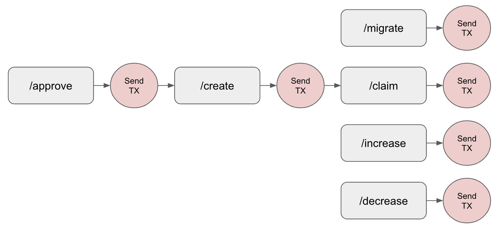

## High Level Message Flow

The following diagram illustrates how a customer starting with no liquidity position can create and manage a liquidity position. Steps in gray are taken through the Uniswap Labs API and steps in red are written to the blockchain by the customer.

1. The customer checks if they have the necessary approval to send token(s) to the desired pool using an [`/approve`](../endpoints/v1/liquidity/check-approval) request.
   1. If the approval is not yet in place, a fully-formed transaction is returned for the customer to sign for each un-approved token.
2. The customer then proposes the position they would like to create using the [`/create`](../endpoints/v1/liquidity/create-pool) request. 
   1. The API checks if the pool already exists. If the pool does not exist, the response returns a fully-formed transaction to create the pool which the user must sign.
   2. The API also returns the fully-formed transaction to create a position (e.g. add liquidity to a pool), which the user must sign.
3. Over time the customer may want to perform additional actions to manage their liquidity pool (LP) positions:
   1. Commonly, liquidity providers will want to claim their earned fees from the pool using the [`/claim`](../endpoints/v1/liquidity/claim-fees) request.
   2. Customers may want to change the allocation of tokens they have made to a pool. Customers can add additional tokens to a pool using the [`/increase`](../endpoints/v1/liquidity/increase-position) request and can reduce or fully withdraw their position using the [`/decrease`](../endpoints/v1/liquidity/decrease-position) endpoint.
   3. Uniswap Labs continues to innovate on pool contracts, customers may want to migrate their positions from one version of a pool to another version. the [`/migrate`](../endpoints/v1/liquidity/migrate) endpoint allows a customer to move their liquidity from a V3 pool to a V4 pool (remaining within the same pair, for example WBTC/USDC).
   4. Certain pools may offer the opportunity to receive rewards for LPing. These rewards can be claimed using the [`/claim_rewards`](../endpoints/v1/liquidity/claim-rewards) endpoint.