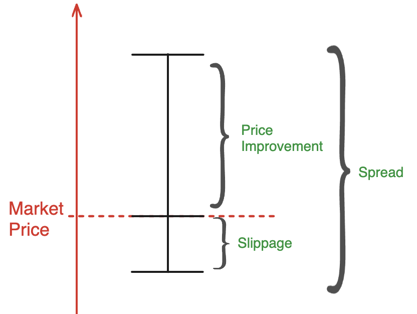

## API Enablement

### How Long Does It Take to Integrate the API?

Integration of the API can be done in less than two weeks. We provide [sample code](/docs/api/guides/swapping/swapping-code-examples) to help get you off the ground quickly. To get started, reach out to request an API key. If you are not yet in touch with Uniswap Labs, register your interest in integrating the API through the [Uniswap Developer Platform](https://developers.uniswap.org/dashboard/welcome). 

### What Are the API Rate Limits?

By default, each API key is rate limited to 3 requests per second. If a higher rate is needed, please reach out through the help button in the [Uniswap Developer Platform](https://developers.uniswap.org/dashboard/welcome).

### What Permit2 Address Do I Need to Whitelist for Approvals?

The Permit2 address for all chains we support **EXCEPT** zkSync is: `0x000000000022D473030F116dDEE9F6B43aC78BA3`.

The Permit2 address for zkSync is: `0x0000000000225e31D15943971F47aD3022F714Fa`.

## Quotes and Quoting

### What Parameter Determines If I Receive a Gasless Quote?

When the [/quote](/docs/api-reference/aggregator_quote) endpoint's `routingPreference` is set to `BEST_PRICE`, the endpoint will attempt to find a quote that nets users the best execution price for a trade. Assuming the `protocols` are not limited, the endpoint will attempt to get a gasless order and a Uniswap Protocol swap quote, calculate which is currently providing the best price to the user including transaction costs, and return that quote. 

Integrators of the API who only want gasless quotes may limit the `protocols` considered to just gasless options (e.g. UniswapX - see [Swap Routing](/docs/api/concepts/swap-routing) for more details).

There are some scenarios where the API will not be able to get a gasless quote, even if the integrator attempts to force it. The most common reason for this (on chains where UniswapX is supported) is that the gas price of the swap is too high relative to the value of the trade. In cases where the gas cost is 20% or more of the total trade value, the API will always return Uniswap Protocol swap quotes (if permitted by `protocols`) or fail.

### How Often Are Quotes Refreshed?

Whenever you request a quote from the APIs, a new check is performed to get the freshest pricing.

### How Do You Recommend Setting Slippage?

We recommend using our automatic slippage option in the /quote request. However, you may use your own slippage algorithm and directly populate your preferred slippage in the /quote request. When setting your own slippage, we recommend setting a low slippage for stable-to-stable swaps (ex. 20bps) and a higher slippage for stable-to-non-stable swaps and non-stable-to-non-stable swaps (since there is more price volatility between these pairs).

### How Should I Handle Failed Quotes?

If a quote fails, the response includes helpful information to understand the problem with the request. The most common quote failure reason is that no route can be found for the quoted pair. This can occur for various reasons, including: all available routes would exceed the slippage tolerance, insufficient liquidity for the requested quote size, or no available route through the specified protocols. We recommend retrying the quote but modifying one or more parameters of the requested quote (ex. protocols used, slippage allowed, or the size of the swap).

### How Do I Quote the Native Token?

See [How Do I Swap Native Tokens?](/docs/api/supported-chains#how-do-i-swap-native-tokens). Note, to quote the native token via UniswapX you must set the [`x-erc20eth-enabled` header](/docs/api-reference/aggregator_quote) in your quote request to `true`.

### Why am I getting "No Quotes Available" as a response?

A quote response with "No Quotes Available" means that the Uniswap router was unable to find a route for the proposed swap. This can happen for a number of reasons, many of which can be easily avoided by understanding the API constraints. While not exhaustive, some of the most common issues are:
* There is insufficient liquidity to fill the swap
* If making a bridge request, the selected token cannot be bridged between the two selected networks (check [Supported Bridges](/docs/api-reference/get_swappable_tokens))
* If making a UniswapX-only request, the amount is less than 1000 USDC equivalent for L2s or less than 300 USDC for L1s (see [Supported Chains](/docs/api/supported-chains#uniswapx-chain-support))
* The request is requesting a bridge and swap (currently not supported)

## Swapping

### How Can I Simulate a Swap Before Submitting It?

Whenever you request a quote from our endpoints we will automatically simulate the quote to ensure that the result will be a viable route should you decide to proceed to the swap step. Further, when you make a request to the [`/swap`](/docs/api-reference/create_swap_transaction) endpoint, you may request that the calldata we generate be simulated to further ensure that it is valid and will be processed. (Note that simulation is not a guarantee that a swap will be successful on chain as factors including gas and slippage may change between the time of the /swap response and you placing the transaction on chain).

## Reference Data

### Can I Query All Tokens Available to Trade?

No, at this time we do not offer an endpoint to query all tokens which are tradable. For more information on tradable tokens, see our guide on [Supported Chains and Tokens](/docs/api/supported-chains).

## Mechanics of UniswapX

### Why Do UniswapX Quotes Have More Slippage Than the Tolerance I Set?

Quotes in UniswapX work differently than they do in the Uniswap AMMs. While AMM quotes return the market price with some buffer for slippage, UniswapX works to get users price improvement _over the market price._ The difference between the best and worst price in a UniswapX order is called its **spread**. 

When you set a Slippage Tolerance in your quote request, you're only setting the amount below the market price you are willing to accept. UniswapX will still return a spread larger than your slippage tolerance when it's able to find a price above the market price. 

### What is a Priority Quote?
UniswapX supports multiple auction types that take advantage of different properties of different chains. When you request a UniswapX quote, depending on the chain, the API will return the following quote/auction:
- Mainnet: DutchV2
- Arbitrum: DutchV3
- Base: Priority
In other words, a Priority quote is a specific UniswapX auction type. Uniswap will notify you of the auction type being used in the quote response. For more information on different auction types, check out [our docs here](/docs/liquidity/uniswapx/concepts/auction-types).

## Commercial

### Are There Restrictions On How I Can Integrate the API?

No, we are very flexible regarding how you decide to offer the API through your application. Customers may create a whitelabel swap experience, add swapping to a custodial wallet, integrate the APIs into a mobile application, and more.

### Can I Restrict Token Pairs Available to My Users?

The APIs do not offer a way to restrict which tokens may be requested to the API, but your application may apply rules to restrict the list of tokens which your end users can access.

### Can I Trial the API?

Yes, sign up for a free developer account at [Uniswap Developer Platform](https://developers.uniswap.org/dashboard/welcome). From there you can generate API keys and test at your own speed.

## Fees

### Is There A Cost to Use the API?

No, the API is free to use.

### How Can I Set My Own Fees?

API Integrators can set their own fee by providing the fee they will take from the swapper in their `/quote` request. See the [`integratorFees` fields](/docs/api-reference/aggregator_quote).

### Does Uniswap Take Positive Slippage as Fees?

No. Uniswap Labs never takes positive slippage. All price improvement achieved at execution is for the benefit of the end swapper.

## Support

### Who Do I Contact for Technical Support?

If you require technical support, please reach out via the help link in the [Uniswap Developer Platform](https://developers.uniswap.org/dashboard). Note that we are unable to provide technical assistance with troubleshooting your code, deployment, or workflow.

### Is There A Sandbox Environment?

No, we do not offer a sandbox environment. Tests can be performed against our [supported testnets](/docs/api/supported-chains) through the production endpoints.

### Do You Offer Any Customer Dashboards, Metrics, Monitoring, or Usage?

At this time we do not provide any customer dashboards, metrics, monitoring, or usage reports. However, we hope to bring these to you soon as we continue to improve our API service offerings.
