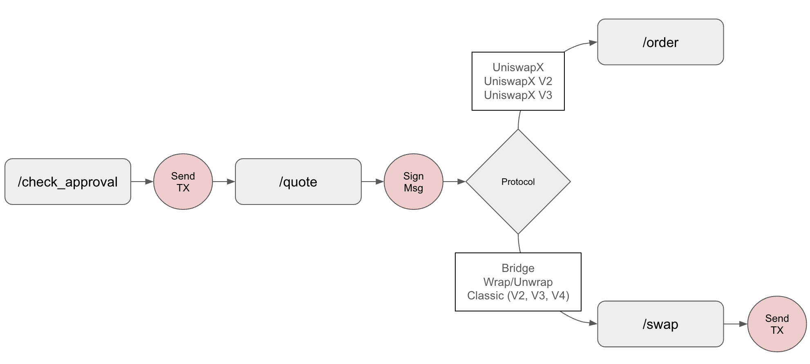
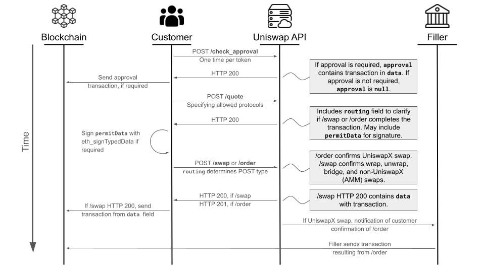

## High Level Message Flow

The diagram below is an a illustration of the token swap flow where steps in gray are taken through the Uniswap Labs API and steps in red are written to the blockchain by the customer.

1. The customer checks if they have given the necessary approval to the [Permit2 contract](/docs/protocols/permit2/overview) to spend the token they intended to swap through a [`/check_approval`](../endpoints/v1/swapping/check-approval) request.
   1. If the approval is not yet in place, a fully-formed transaction is returned to the customer to sign.
2. The customer makes a request for quote for their desired swap using a [`/quote`](../../endpoints/v1/swapping/quote) request.
   1. Quotes are requested whether the customer is seeking to perform a token for token swap, a cross-chain bridge, or a token wrap/unwrap.
   2. Customer specifies their desired execution paths (Uniswap protocols or UniswapX) through the `protocols` array (see more below).
   3. Customer receives back the best available quote and a fully-formed transaction for signature to approve the the swap.
3. Depending upon the desired outcome and selected `protocols`, the customer makes either an [`/order`](../../endpoints/v1/swapping/uniswapX/create-order) or [`/swap`](../../endpoints/v1/swapping/protocol/create-swap) API request 
   1. `/order` requests are submitted when the swap will be filled by a UniswapX RFQ market maker. In this case the order is "gasless" because the market maker will write the transaction to chain to fill the swap.
   2. `/swap` requests are submitted when the swap will be filled by a "classic" v2, v3, or v4 Uniswap protocol pool, or in the event that the swap is a bridge or a token wrap/unwrap. This is a "gasful" transaction because the customer will write the transaction to the chain to fill the swap.

## Detailed Message Flow

The following diagram provides a more detailed explanation of the API endpoint call flow. In the diagram, the API user (e.g. you) are represented by the "Customer". Additionally note:

- Every arrow represents a message exchanged between the two indicated parties.
- Bolded values are API calls or specific fields or values within an API request or response.
- The import important details of the request or response are called out with helper text, but complete details of every request and response field can be found within the Token Trading endpoints found further on in this documentation.
- Note that customers must take different actions depending on the result of their /quote request. The /quote request may result in a proposed swap against Uniswap or other public protocols, causing the following API request from the customer to be a /swap. Alternatively, the /quote request may result in a proposed swap with a private liquidity filler, causing the following API request from the customer to be an /order.

