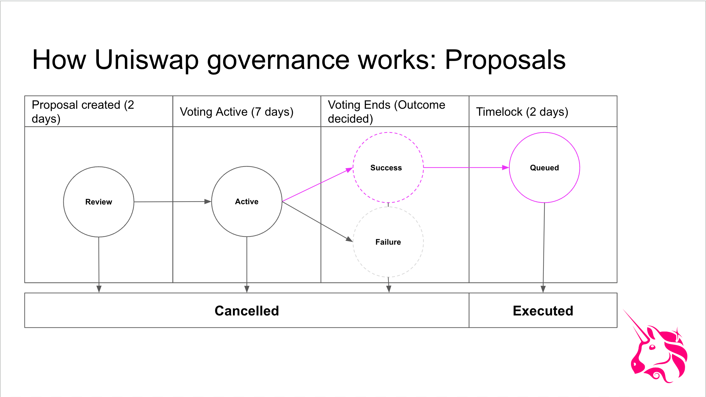

This section is a living document which represents the current process guidelines for developing and advancing proposals through the Uniswap Governance system. It was last updated in January 2026.

## Process

The Uniswap governance process ensures that proposals receive thorough community review before being executed onchain. Below is the three-phase framework that every proposal must complete.

## Phase 1: Request for Comment (RFC)

- **Duration:** Minimum 7 days
- **Location:** [Governance Forum](https://gov.uniswap.org)
- **Purpose:** Introduce your proposal and gather initial feedback

### What to do

1. Create a forum post titled `RFC - [Your Title Here]`.
2. Clearly explain what you are proposing and why it benefits Uniswap.
3. Engage with the community by responding to questions and feedback.
4. Iterate on your idea based on community input before moving to Phase 2.

Allow at least 7 days for discussion before moving to Phase 2. Successful proposals demonstrate willingness to adapt based on community feedback. If general community consensus or approval is not clear by the end of the 7-day period, the proposal should not move to Phase 2: Temperature Check.

## Phase 2: Temperature Check

- **Duration:** 5 days
- **Location:** [Snapshot](https://snapshot.org/#/uniswap)
- **Requirement:** 10M UNI voting `for` to advance
- **Purpose:** Gauge community sentiment through an offchain vote

### What to do

1. Refine your proposal using feedback from the RFC phase.
2. Create a Snapshot poll with a brief overview of your proposal from the RFC, calling out key components and any changes from RFC to Snapshot phase. The poll lasts for 5 days and voters have the option to vote `for`, `against`, or `abstain`.
3. Update your forum post with the Snapshot poll link for ease of access.

### Advancement criteria

The proposal must receive at least 10M UNI in `for` votes to move to the next phase. If `against` wins, the proposal does not advance.

## Phase 3: Onchain Governance Proposal

- **Duration:** 2-day waiting period, 7-day voting period, 2-day timelock (if passed)
- **Location:** [Agora](https://vote.uniswapfoundation.org/) or [Tally](https://www.tally.xyz/gov/uniswap)
- **Requirements:**
  - 1M UNI delegated to submit the proposal
  - 40M UNI voting in favor to pass
- **Purpose:** Execute binding, onchain changes to Uniswap

### What to do

1. Make any final refinements based on Temperature Check feedback.
2. Prepare your proposal code:
   - Use an interface like Agora or Tally for standard proposals.
   - Write custom calldata for complex logic.
3. Check Seatbelt:
   - Seatbelt is a governance helper tool that simulates the calldata in your proposal. If the proposal were to pass as written, Seatbelt shows expected onchain state changes and emitted events.
   - As of winter 2026, both Agora and Tally have integrated Seatbelt simulations into their proposal posting flows. If building calldata and posting locally, Seatbelt is available on the [Uniswap Foundation's GitHub](https://github.com/uniswapfoundation/governance-seatbelt).
4. Submit the proposal:
   - Ensure your address has 1M UNI delegated, or
   - Partner with a delegate who meets this threshold to post.
5. Wait for the process to complete:
   - 2-day voting delay before voting begins
   - 7-day voting period for the community to vote
   - 2-day timelock before execution (if passed)

### What happens next

If the proposal receives 40M UNI in favor votes and passes, the associated onchain actions are queued for anyone to execute after the timelock period ends.

## Changes to the Governance Process

- **Duration:** 7 days
- **Location:** [Snapshot](https://snapshot.org/#/uniswap)
- **Requirement:** 40M UNI quorum

In the future, the community governance process above may need to undergo additional changes to continue to meet the needs of the Uniswap community. While an onchain vote is not required to change the majority of this process, a clear display of community support and acceptance is important for process changes to have legitimacy.

Thus, changes to all offchain community governance processes should be voted on through an offchain Snapshot vote. There should be a 7-day voting period and 40M UNI quorum.

## Tools

Uniswap Governance follows a three-phase process and takes place across several platforms:

- [Governance Forum](https://gov.uniswap.org/)
  - A Discourse-hosted forum for governance-related discussion. All governance proposals start in the forum. Community members register accounts and can post, like, and comment on topics.
- [Snapshot](https://snapshot.org/#/uniswap)
  - A voting interface that allows users to signal sentiment offchain before a proposal moves to a final onchain vote. Votes on Snapshot are weighted by UNI delegated to the voting address.
- Onchain voting interfaces
  - [Agora](https://vote.uniswapfoundation.org/) and [Tally](https://www.tally.xyz/gov/uniswap) are the primary interfaces for delegation and voting. Both teams are funded by grants, with Agora funding from the [Uniswap Foundation](https://www.uniswapfoundation.org/) and Tally funding from [DUNI](https://www.tally.xyz/gov/uniswap/proposal/74).
