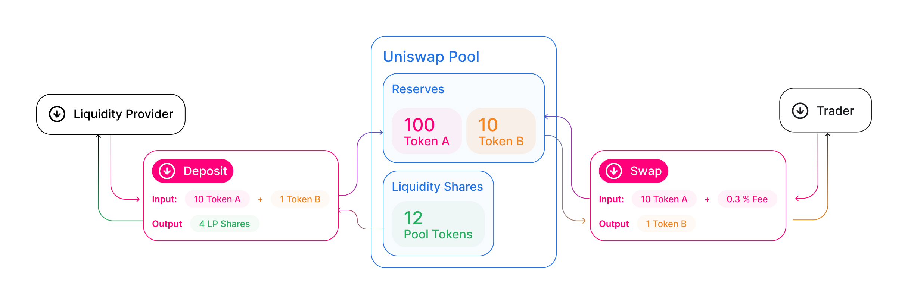
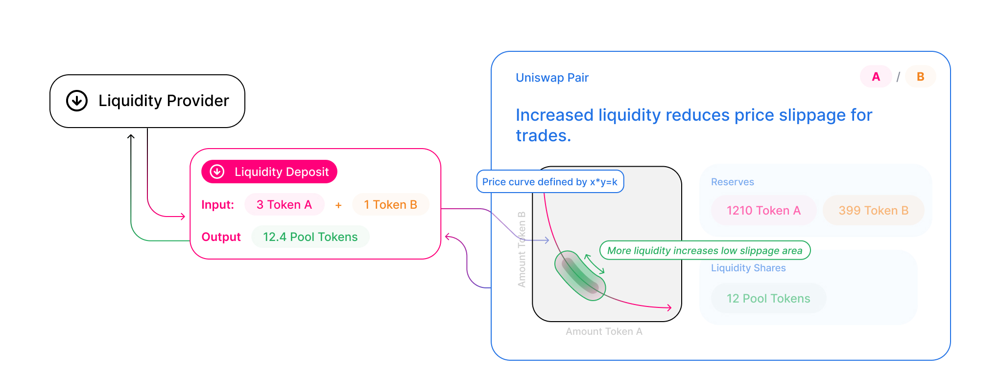
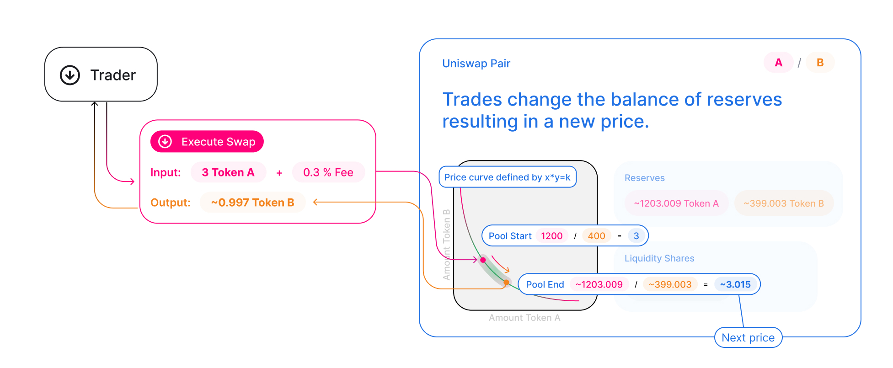

Uniswap is a decentralized exchange protocol built on [Ethereum](https://ethereum.org/). 

Instead of relying on order books, Uniswap is an **automated market maker (AMM)** or a set of smart contracts that let anyone swap tokens, provide liquidity, or create new markets directly onchain.

The protocol is **open-source** ([GPL-licensed](https://en.wikipedia.org/wiki/GNU_General_Public_License)), non-upgradeable, and designed for **decentralization**, **censorship resistance**, and **self-custody**.

## Liquidity pools

Each Uniswap smart contract, or pair, manages a **liquidity pool** made up of reserves of two [ERC-20](https://eips.ethereum.org/EIPS/eip-20) tokens and updates price based on pool state.



Anyone can become a liquidity provider (LP) by depositing token pairs into a pool. 

How LP shares are tracked differs by version: Uniswap v2 mints fungible `ERC-20` pool tokens representing a proportional share of reserves, whereas in v3 and v4, each LP chooses a specific price range and their position is represented as an non fungible position managed by the `NonfungiblePositionManager` in v3 and `PositionManager` in v4.




## Swaps

When a user swaps one token for another, they trade against the pool's reserves. The pool prices tokens algorithmically using a **constant product formula**:
```
x * y = k
```

Here, `x` and `y` are the reserve balances of each token, and `k` is the invariant, a value that must stay constant (or increase) after every trade. This formula means that larger trades relative to pool depth move the price more (known as **price impact**), while smaller trades execute closer to the current spot price.



Swap fees are configured by pool and protocol version (see [Fees](/docs/get-started/concepts/fees)). These fees accrue to LPs, and protocol fees may apply when enabled through governance (see [Governance process](/docs/resources/governance/governance-process)).

## Uniswap vs Traditional Markets

Compared with traditional exchanges, Uniswap differs in two ways: market structure (AMM vs order book) and access model (permissionless vs permissioned).

### Order book vs AMM

Most publicly accessible markets use a central limit [order book](https://www.investopedia.com/terms/o/order-book.asp) style of exchange, where buyers and sellers create orders organized by price level that are progressively filled as demand shifts. Anyone who has traded stocks through brokerage firms will be familiar with an order book system.

The Uniswap protocol takes a different approach, using an Automated Market Maker (AMM), sometimes called a constant function market maker, instead of an order book.
Across versions, this model has evolved: Uniswap v3 introduced concentrated liquidity, and Uniswap v4 keeps that model while adding major architectural and accounting changes such as singleton pools and flash accounting.

At a high level, an AMM replaces buy and sell orders with a liquidity pool of two assets, both priced relative to each other. As one asset is traded for the other, the relative price shifts and the market rate updates. In this model, a trader interacts with the pool directly instead of matching against another user's posted order. AMMs and order books each have tradeoffs, and ongoing research compares their behavior across market conditions.

### Permissionless systems

The second departure from traditional markets is the permissionless and immutable design of the Uniswap protocol. These design decisions align with Ethereum's core principles, where open access and immutable execution reduce reliance on centralized gatekeepers.

Permissionless design means that the protocol's services are entirely open for public use, with no ability to selectively restrict who can or cannot use them. Anyone can swap, provide liquidity, or create new markets at will. This is a departure from traditional financial services, which typically restrict access based on geography, wealth status, and age.

Once deployed, core contracts are not upgradeable. No party can pause them, reverse trade execution, or change protocol behavior retroactively. Governance can enable protocol fee mechanics on supported pools within predefined limits. You can validate governance and fee implementation in the open-source codebases: [Uniswap governance](https://github.com/Uniswap/governance), [Uniswap protocol-fees](https://github.com/Uniswap/protocol-fees), and [Uniswap contracts](https://github.com/Uniswap/contracts).
