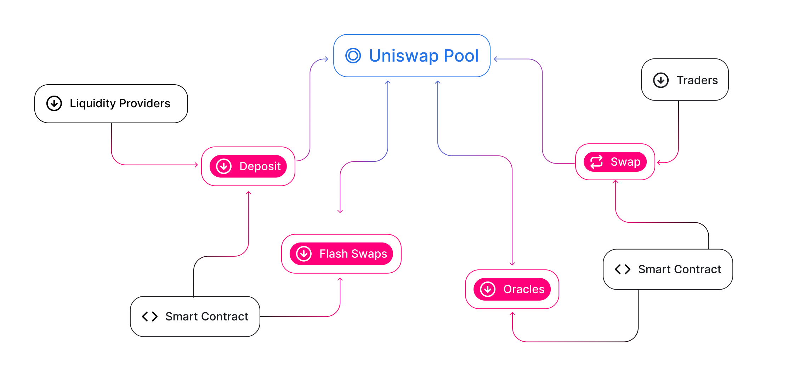

The Uniswap ecosystem includes three primary participant groups: liquidity providers, traders, and developers.

Liquidity providers contribute [ERC-20](https://eips.ethereum.org/EIPS/eip-20) tokens to shared liquidity pools.

Traders swap these tokens against pool liquidity and pay a [fee](/docs/get-started/concepts/fees), which accrues to liquidity providers.

Developers integrate directly with Uniswap smart contracts to build trading interfaces, wallets, and onchain applications.

Interactions between these groups support deeper liquidity, better price discovery, and broader ecosystem integrations.

## Liquidity Providers

Liquidity providers, or LPs, are not a homogeneous group:

- Passive LPs are token holders who wish to passively deposit their assets to accumulate trading fees.
- Professional LPs are focused on market making as their primary strategy. They usually develop custom tools and ways of tracking their liquidity positions across different DeFi projects.
- Token projects sometimes choose to become LPs to create a liquid marketplace for their token. This allows tokens to be bought and sold more easily, and unlocks interoperability with other DeFi projects through Uniswap.
- Finally, some DeFi teams explore advanced liquidity strategies such as incentives, collateralized liquidity, and other experimental mechanisms. With UniswapX, a participant class called [fillers](/docs/liquidity/uniswapx-filling/overview) can provide liquidity by filling user orders offchain.

## Traders

There are several categories of traders in the protocol ecosystem:

- Speculators use a variety of community-built tools and products to swap tokens using liquidity sourced from the Uniswap protocol.
- Arbitrage bots compare prices across platforms and make trades when price gaps appear. This activity helps equalize prices across broader Ethereum markets and maintain price consistency.
- dApp users buy tokens on Uniswap for use in other applications on Ethereum.
- Smart contract systems execute trades on the protocol by implementing swap functionality, from DEX aggregators to custom Solidity scripts.

In all cases, trades pay pool-specific swap fees based on protocol version and pool configuration. Each trader type contributes to price discovery and liquidity usage.

## Developers and Projects

Uniswap is used across many types of Ethereum applications. Common examples include:

- Because Uniswap is open source, many teams build frontends and UX flows for swapping and liquidity management. You can find Uniswap integrations in many major DeFi dashboard projects.
- Wallets often integrate swapping and liquidity provision functionality as a core offering of their product.
- DEX (decentralized exchange) aggregators source liquidity from multiple protocols and can split trades across routes to improve execution outcomes.
- Smart contract developers use Uniswap primitives to build new DeFi tools or products. 

## Community

Contributors across the Uniswap ecosystem, including teams, governance participants, and independent builders, continue to expand protocol usage and integrations.

