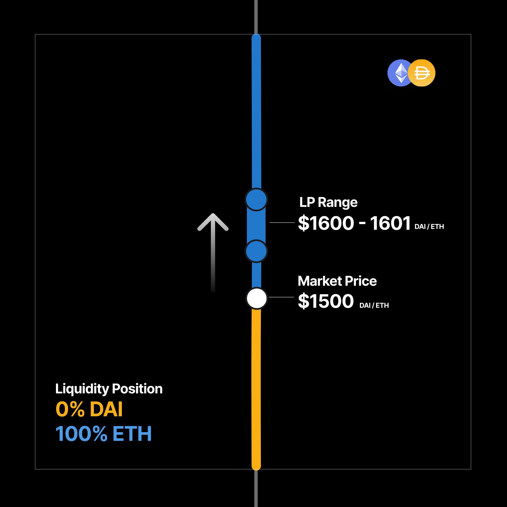
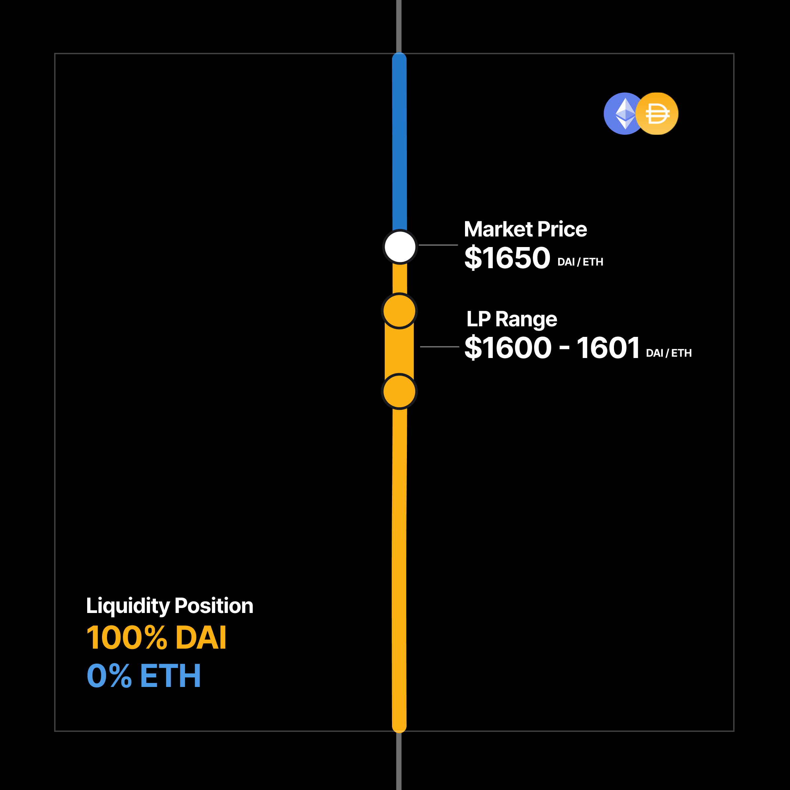

<Callout type="note">
Range orders have the same implementation in both Uniswap v3 and v4, offering consistent functionality across both versions.
</Callout>

Customizable liquidity positions, along with single-sided asset provisioning, allow for a new style of swapping with automated market makers: the range order.

In typical order book markets, anyone can easily set a limit order: to buy or sell an asset at a specific predetermined price, allowing the order to be filled at an indeterminate time in the future.

In Uniswap v3 and v4, you can approximate a limit order by providing a single asset as liquidity within a specific range. Like traditional limit orders, range orders may be set with the expectation they will execute in the future, with the target asset available for withdrawal after spot price crosses the full range.

Unlike some markets where limit orders may incur fees, the range order maker generates fees while the order is filled. This is due to the range order technically being a form of liquidity provisioning rather than a typical swap.

## Types of Range Orders

AMM design makes some limit-order styles possible while others cannot be replicated.

> One important distinction: range orders, unlike traditional limit orders, will be **unfilled** if the spot price crosses the given range and then reverses to recross in the opposite direction before the target asset is withdrawn. While you will be earning LP fees during this time, if the goal is to exit fully in the desired destination asset, you will need to keep an eye on the order and either manually remove your liquidity when the order has been filled or use a third party position manager service to withdraw on your behalf.

### Order types possible with range orders

#### Take-profit orders

> The current price of a DAI / ETH pool is 1,500 DAI / ETH. You would like to sell your ETH for DAI when the price of ETH reaches 1,600 DAI / ETH. This is possible, as the price space above the spot price is denominated in the higher valued asset, ETH. You can provide ETH at a price of 1,600 DAI / ETH and have the order filled when the spot price crosses your position.

&nbsp;&nbsp;&nbsp;&nbsp;&nbsp;&nbsp;&nbsp;

#### Buy limit orders

> The current price of a DAI / ETH pool is 1,500 DAI / ETH. You expect ETH may rebound after it drops to 1,000, so you would like to place a range order swapping DAI to ETH at 1,000 DAI / ETH. This is possible, as the price space below the spot price is denominated in the lower-priced asset, DAI. You can provide DAI at 1,000 DAI / ETH, which will be swapped for ETH when the spot price of ETH drops past 1,000 DAI / ETH.

As the above examples show, in Uniswap v3 and v4, the two paired assets in a given pool are separated above and below the spot price, with the higher-priced asset available above the spot price and the lower-priced asset below.

### Order types not possible with range orders

The following examples show limit-order styles that cannot be replicated due to asset separation in price space.

#### Buy stop orders

> The current price of a DAI / ETH pool is 1,500 DAI / ETH. You expect ETH may rise quickly once it reaches 2,000 DAI / ETH, so you would like to place a range order from DAI to ETH at 2,000 DAI / ETH. This is not possible, because the price space above 1,500 DAI / ETH is denominated in ETH, and you cannot provide the DAI required at that price to be swapped into ETH.

#### Stop-loss orders

> The current price of a DAI / ETH pool is 1,500 DAI / ETH. You expect ETH may drop further once it moves below 1,000, so you would like to place a range order from ETH to DAI at 1,000. This is not possible, because the price space below the spot price is denominated in DAI, and you cannot allocate the ETH required at that level to be swapped into DAI.

## Fees

The fees due to your liquidity position will be denominated in both tokens of the given pair. In any of the above examples, after swapping ETH for DAI, or DAI for ETH, a small amount of both ETH and DAI will be due to your account as liquidity provisioning rewards.

Approaches to concentration when setting range orders are up to the user. Selecting a wider range may generate more fees if there is price churn within your range, at the cost of increasing the risk of having your order unfilled if the spot price reverses before completing your full range.
