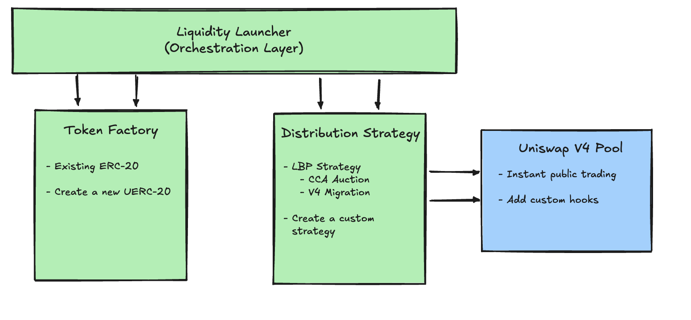

Uniswap Liquidity Launchpad helps you bootstrap liquidity for Uniswap v4 pools using Continuous Clearing Auction (CCA) price discovery and strategy contracts.

## What Is the Uniswap Liquidity Launchpad?

The Uniswap Liquidity Launchpad is a framework for bootstrapping initial liquidity for Uniswap v4 pools through transparent price discovery (see [whitepaper](https://docs.uniswap.org/whitepaper_cca.pdf)). It combines three functions into a composable flow:

1. **Price Discovery**: run fair auctions using a novel Continuous Clearing Auction (CCA) mechanism to establish market price.
2. **Liquidity Bootstrapping**: automatically seed Uniswap v4 pools with auction proceeds at the discovered price.
3. **Token Creation** (optional): deploy new ERC-20 tokens with metadata or integrate existing tokens.

Unlike approaches that rely on centralized market makers or timing advantages, this system provides an open mechanism for bootstrapping deep liquidity on decentralized exchanges.

The system is composable and can support additional auction and strategy implementations.

### Key benefits

- **Fair Price Discovery**: continuous clearing auctions reduce timing games and improve price discovery.
- **Immediate Deep Liquidity**: transition from price discovery to active Uniswap v4 trading with substantial initial depth.
- **Permissionless**: anyone can bootstrap liquidity or participate in price discovery without gatekeepers
- **Transparent**: all parameters are immutable after they are set
- **Composable**: modular architecture supports multiple auction formats and distribution strategies
- **Gas Efficient**: optimized implementations using Permit2, multicall, and efficient data structures

## Core Components

The Uniswap Liquidity Launchpad framework is built on three coordinated components:

1. **[Liquidity Launcher](https://github.com/Uniswap/liquidity-launcher)** coordinates distribution and liquidity deployment.
2. **[Token Factory](https://github.com/Uniswap/uerc20-factory)** optionally creates new ERC-20 tokens with metadata.
3. **Liquidity Strategies** define how auction outcomes migrate into pool liquidity. See [custom strategy guidance](/docs/protocols/liquidity-launchpad/concepts/liquidity-strategies#writing-a-custom-strategy).

Each component is composable and extensible so you can customize your launch flow while preserving clear onchain behavior.

## High-Level Architecture

Review the architecture and implementation details in [Liquidity Strategies](/docs/protocols/liquidity-launchpad/concepts/liquidity-strategies) and [Deployments](/docs/protocols/liquidity-launchpad/deployments).

### Example flow

1. **Prepare Token** (optional): create or configure the token distribution input.
2. **Deploy Strategy**: call `LiquidityLauncher.distributeToken()` to deploy strategy and auction contracts.
3. **Auction Completion**: CCA finalizes clearing state and raised funds.
4. **Seeding Liquidity**: call `migrate()` after `migrationBlock` to initialize the Uniswap v4 pool and liquidity positions.
5. **After Migration**: participants claim tokens after `claimBlock`, and strategy/auction balances are swept by configuration.

## Where to Go Next

- Learn about the [Continuous Clearing Auction](/docs/protocols/liquidity-launchpad/concepts/cca) mechanism
- Read the [CCA whitepaper](https://docs.uniswap.org/whitepaper_cca.pdf)
- For full address tables and versions, see [Deployments](/docs/protocols/liquidity-launchpad/deployments)
